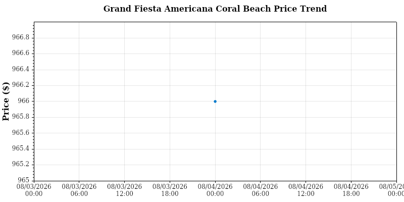

# Cancun Resort Price Tracker

A fully automated, resilient price‑tracking pipeline for the **Grand Fiesta Americana Coral Beach Cancun Resort**.

This system monitors real‑time room rates, logs historical prices to CSV, and sends Gmail alerts when the price drops below your target threshold.

---

## Live Dashboard
<!-- START_DASHBOARD -->
## Price Trend Graph



## Live Dashboard

| Attribute | Details |
|---|---|
| **Resort** | Grand Fiesta Americana Coral Beach Cancun |
| **Room Type** | `Ocean Front Suite Double (2 Queen)` |
| **Rate Plan** | `I Prefer Member Rate` |
| **Dates** | 2027-03-22 ~ 2027-03-26 |
| **Current Price** | **$966** |
| **Target Threshold** | **$970.00** |
| **Status** | **DEAL DETECTED** |
| **Last Updated** | `2026-08-04 21:56:07 UTC` |
<!-- END_DASHBOARD -->

---

## Key Features

- Real‑time scraping via Playwright (Synxis booking engine)
- Deep‑link navigation for targeted check-in/out dates and room types
- Regex & Selector fallback price extraction for maximum stability
- Historical price logging via `price_history.csv`
- Automated ScottPlot trend graph generation (`price_trend.png`)
- Gmail SMTP alerts when current price drops below target
- Automated daily runner via GitHub Actions scheduler

---

## Tech Stack

- .NET 10
- Playwright (Chromium)
- ScottPlot
- System.Net.Mail (Gmail App Password)
- GitHub Actions (CI Scheduler)

---

## Architecture Overview

### Scraper Engine
- Builds Synxis deep‑link URLs with parameters (`adult`, `arrive`, `depart`, `hotel`, etc.)
- Loads page via Playwright (headless Chromium) with `DOMContentLoaded` wait state
- Locates target room rate section and parses numeric price

### Pipeline & Dashboard Automation
- Runs daily via GitHub Actions cron schedule
- Appends latest price entry to `price_history.csv`
- Renders 10-day historical chart via ScottPlot
- Sends Gmail alerts if `currentPrice <= targetPrice`
- Dynamically updates the README Live Dashboard section

---

## Environment Variables

Configure via GitHub Actions Secrets or local environment:

```
EmailSettings__SenderEmail=your@gmail.com
EmailSettings__SenderPassword=your_app_password
EmailSettings__SenderName=Cancun Price Tracker
EmailSettings__RecipientEmail=your@gmail.com
TARGET_THRESHOLD=970.00
CHECK_IN=2027-03-22
CHECK_OUT=2027-03-26
SEARCH_ROOM=Ocean Front Suite Double (2 Queen)
SEARCH_RATE=I Prefer Member Rate
```

---

## Author

**Scott Lee**  
Software Engineer • Automation & Systems Development  
[LinkedIn](https://www.linkedin.com/in/scott-lee-dev/) • [GitHub](https://github.com/scottlee-dev)